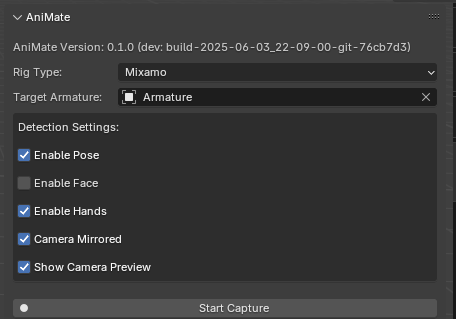

# AniMate

A Blender plugin for animating humanoid rigs using motion capture data from MediaPipe.

## Features

- Real-time motion capture using MediaPipe
- Support for pose, face, and hand tracking
- Modular, extensible architecture with clear separation of detection, mapping, rig, UI, and utility logic
- Configurable bone mappings for Mixamo, Rigify, and Maya rigs

## Implementation Status

### Features Implemented
- Basic finger movement tracking and application to the rig
- Core pose detection and tracking
- Fundamental rig mapping for Mixamo and Rigify rigs

### Features Till Release
- Smooth and natural movement of the fingers, hands, and arms
- Enhanced motion filtering and stabilization
- Improved accuracy in finger and hand tracking

## Project Status

🚧 **Under Development** 🚧

The project is currently in active development. Core functionality is implemented but may have bugs or missing features.

## Installation

1. Clone the repository:
```bash
git clone https://github.com/kreanimator/AniMate.git
cd AniMate
```

2. Install Python dependencies:
```bash
pip install -r requirements.txt
```

3. Package the Blender addon:
```bash
bash package_addon.sh
```
This will create `animate_addon.zip` in your project root.

4. Install the Blender addon:
   - Open Blender
   - Go to Edit > Preferences > Add-ons
   - Click "Install" and select the `animate_addon.zip` file you just created
   - Enable the addon by checking the box next to "Animation: AniMate"

## Manual Dependency Installation (for Snap/Flatpak/Custom Blender)

**Important:** If you are using Blender from Snap, Flatpak, or a custom build, you must manually install all dependencies from `requirements.txt` into Blender's Python environment.

### Steps:
1. Find Blender's Python executable:
   ```bash
   blender --background --python-expr "import sys; print(sys.executable)"
   # Example output: /home/youruser/snap/blender-4.3.2-linux-x64/4.3/python/bin/python3.11
   ```
2. Find Blender's site-packages directory:
   ```bash
   blender --background --python-expr "import site; print(site.getsitepackages()[0])"
   # Example output: /home/youruser/snap/blender-4.3.2-linux-x64/4.3/python/lib/python3.11/site-packages
   ```
3. For each dependency in `requirements.txt`, run:
   ```bash
   /path/to/blender/python/bin/python3.11 -m pip install --target=/path/to/blender/python/lib/python3.11/site-packages <package>
   # Example:
   /home/youruser/snap/blender-4.3.2-linux-x64/4.3/python/bin/python3.11 -m pip install --target=/home/youruser/snap/blender-4.3.2-linux-x64/4.3/python/lib/python3.11/site-packages packaging
   /home/youruser/snap/blender-4.3.2-linux-x64/4.3/python/bin/python3.11 -m pip install --target=/home/youruser/snap/blender-4.3.2-linux-x64/4.3/python/lib/python3.11/site-packages opencv-python
   /home/youruser/snap/blender-4.3.2-linux-x64/4.3/python/bin/python3.11 -m pip install --target=/home/youruser/snap/blender-4.3.2-linux-x64/4.3/python/lib/python3.11/site-packages mediapipe
   /home/youruser/snap/blender-4.3.2-linux-x64/4.3/python/bin/python3.11 -m pip install --target=/home/youruser/snap/blender-4.3.2-linux-x64/4.3/python/lib/python3.11/site-packages Pillow
   ```

**Note:** You must repeat this for every dependency in `requirements.txt`.

## Project Structure

```
AniMate/
├── __init__.py            # Addon entry point and registration
├── bpy_ui/                # Blender UI panels, operators, and properties
│   ├── panels.py
│   ├── operators.py
│   ├── properties.py
│   └── __init__.py
├── detection/             # MediaPipe-based detection logic
│   ├── mediapipe_detector.py
│   ├── __init__.py
│   └── README.md
├── mapping/               # Rig mapping logic for different rig types
│   ├── mixamo_mapping.py
│   ├── rigify_mapping.py
│   ├── maya_mapping.py
│   ├── base_mappings.py
│   ├── mapping_factory.py
│   ├── __init__.py
│   └── README.md
├── rig/                   # Rig management, driver, and transfer logic
│   ├── blender_mapper.py
│   ├── drivers.py
│   ├── transfer.py
│   └── __init__.py
├── utils/                 # Utility functions (math, coordinate transforms, etc)
│   ├── math_utils.py
│   └── __init__.py
```

## Module Overview

- **bpy_ui/**: All Blender UI logic (panels, operators, properties). Defines the AniMate panel, capture controls, and user settings.
- **detection/**: MediaPipe-based detection logic for pose, hands, and face. Provides real-time landmark extraction.
- **mapping/**: Rig mapping classes for Mixamo, Rigify, and Maya. Handles bone hierarchy, landmark-to-bone mapping, axis corrections, and rotation limits.
- **rig/**: Core rig management, driver creation, and transfer logic. Handles driver empties, constraints, and applying landmark data to the rig.
- **utils/**: Math and coordinate transformation utilities for converting MediaPipe data to Blender space.

## Usage

### In Blender

1. Open Blender and load your humanoid rig
2. In the 3D Viewport, open the sidebar (N key)
3. Go to the "AniMate" tab
4. Select your armature in the "Target Armature" field
5. Configure detection settings (pose, face, hands)
6. Click "Start Capture" to begin motion capture
7. Landmarks will be drawn on the camera preview, and the rig will animate in real time if mapping is correct

### Using Sample scene

When using different rig types (Rigify, Mixamo, etc.), it's important to manage which rigs are visible in your scene. The AniMate addon allows you to choose which rig type to use for motion capture, and you may want to hide other rigs to avoid visual clutter and ensure clear positioning:


To set up your motion capture scene:
1. Choose your target rig type in the AniMate panel (Rigify, Mixamo, etc.)
2. Hide other rigs that you're not using for capture to keep the scene clean
   - For example, if you're using a Rigify rig, you can hide the Mixamo rig
   - If you're using a Mixamo rig, you can hide the Rigify rig
3. For Rigify rigs specifically, you can also manage individual rig layers:
   - Hide unnecessary rig layers that aren't being used for motion capture
   - Keep only the layers containing the bones you want to animate
   - Use the layer visibility toggles in the Armature properties panel

This helps maintain a clean workspace and makes it easier to position and work with your chosen rig.

## Modularity & Extensibility

AniMate is designed for easy extension:
- Add new rig types by creating a new mapping class in `mapping/` and registering it in `mapping_factory.py`.
- Add new detection logic in `detection/`.
- Extend the UI by adding new panels or operators in `bpy_ui/`.
- Add math or coordinate utilities in `utils/`.

## Contributing

### Initialization

1. Fork the repository: https://github.com/kreanimator/AniMate
2. Clone your fork:
   ```bash
   git clone https://github.com/YOUR_USERNAME/AniMate.git
   cd AniMate
   ```
3. Set up your development environment:
   ```bash
   pip install -r requirements.txt
   ```

### Development Workflow

1. Keep your fork up to date:
   ```bash
   # Add upstream remote
   git remote add upstream https://github.com/kreanimator/AniMate.git

   # Fetch upstream changes
   git fetch upstream

   # Update your main branch
   git checkout main
   git merge upstream/main
   ```

2. Create a feature branch:
   ```bash
   git checkout -b feature/your-feature-name
   ```

3. Make your changes and commit:
   ```bash
   git add .
   git commit -m "Add: your feature description"
   ```

4. Push to your fork:
   ```bash
   git push origin feature/your-feature-name
   ```

### Pull Request Process

1. Ensure your code follows our standards:
   - Follow PEP 8 guidelines
   - Add docstrings for new functions/classes
   - Write tests for new features
   - Update documentation if needed

2. Create a Pull Request:
   - Go to your fork on GitHub
   - Click "New Pull Request"
   - Select your feature branch
   - Fill in the PR template
   - Submit the PR

3. Keep your PR up to date:
   ```bash
   git fetch upstream
   git checkout feature/your-feature-name
   git merge upstream/main
   git push origin feature/your-feature-name
   ```

### Code Standards

1. **Python Code Style**
   - Follow PEP 8 guidelines
   - Use meaningful variable and function names
   - Add docstrings for all public functions and classes
   - Keep functions focused and small
   - Use type hints where appropriate

2. **Commit Messages**
   - Use clear and descriptive messages
   - Start with a verb in present tense (e.g., "Add", "Fix", "Update")
   - Reference issue numbers when applicable
   - Keep messages concise but informative

3. **Testing**
   - Write tests for new features
   - Ensure all tests pass before submitting PR
   - Update tests when modifying existing features

4. **Documentation**
   - Update README.md for significant changes
   - Add docstrings for new functions/classes
   - Update inline comments when modifying complex logic

## License

This project is licensed under the MIT License - see the LICENSE file for details.

## Acknowledgments

- MediaPipe for the motion capture technology
- Blender for the 3D animation platform

## Packaging and Installing the Addon in Blender

To install this addon in Blender, you need to package all required folders into a single zip file. Use the provided shell script:

1. Open a terminal in your project root.
2. Run:
   ```bash
   bash package_addon.sh
   ```
3. This will create `animate_addon.zip` in your project root.
4. In Blender, go to `Edit > Preferences > Add-ons > Install`, and select `animate_addon.zip`.
5. Enable the addon in the list.

**The script will include:**
- `animate_addon/` (main addon code)
- `rig/` (rig logic and mappings)
- `data/` (any data files needed)

If you add more dependencies (like `utils/` or `examples/`), uncomment the relevant lines in `package_addon.sh`.

## Test Scene for Blender Development

A sample Blender file is provided for development and testing:

- **data/sample_scene_with_mixamo_rig.blend**

This file contains multiple rigs (Mixamo and Rigify) for testing different rig types. **Important Note:** When using this sample scene, you need to hide the rig you're not currently using for motion capture. For example:
- If you're testing with the Rigify rig, hide the Mixamo rig
- If you're testing with the Mixamo rig, hide the Rigify rig

This is necessary because the sample scene includes multiple rigs to demonstrate different rig types, but during actual motion capture, you should only have one active rig visible at a time.

## Planned Features & Future Releases

AniMate is actively evolving! Planned features for future releases include:

- **Smooth and natural movement**: Enhanced finger, hand, and arm movement with improved motion filtering and stabilization.
- **Motion capture from image/video files**: Animate rigs using prerecorded video or image sequences, not just live camera input.
- **Multiple rig type support**: Seamless switching and mapping for Mixamo, Rigify, Maya, and custom rigs.
- **Locked posing and region isolation**: Lock specific bones or regions (e.g., hands, feet, head) to prevent unwanted movement during capture.
- **Improved UI/UX**: More intuitive controls, status indicators, and capture feedback.
- **Advanced retargeting and smoothing**: Better motion smoothing, filtering, and retargeting options.
- **Batch processing and automation**: Tools for automating capture and animation workflows.
- **More extensibility hooks**: Easier ways for developers to add new rig types, mappings, or detection modes.

If you have feature requests or want to contribute, please open an issue or pull request!

## Build Version Display

AniMate displays the exact build version in its UI panel for easy debugging and version tracking. Every time you package the addon, a unique build string is generated and shown in Blender:



**Example:**
```
AniMate Version: 0.1.0 (dev: build-2025-06-03_22-09-00-git-76cb7d3)
```
- `build-2025-06-03_22-09-00` is the build timestamp (YYYY-MM-DD_HH-MM-SS)
- `git-76cb7d3` is the short git commit hash

This ensures you always know which build is installed, helping to avoid confusion when testing or debugging new features.
